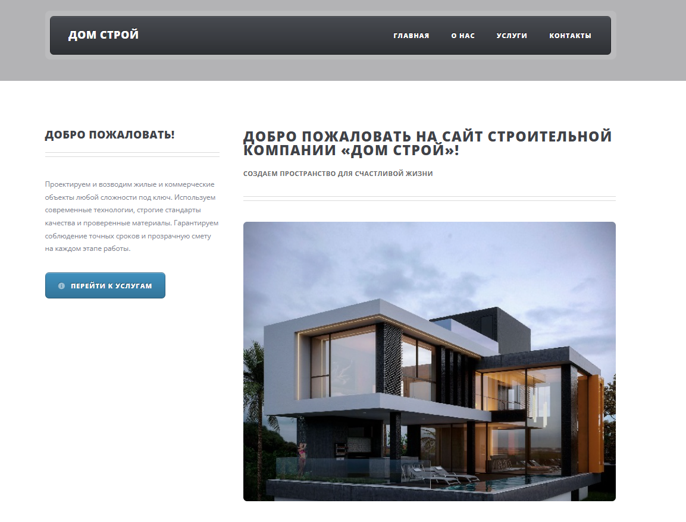
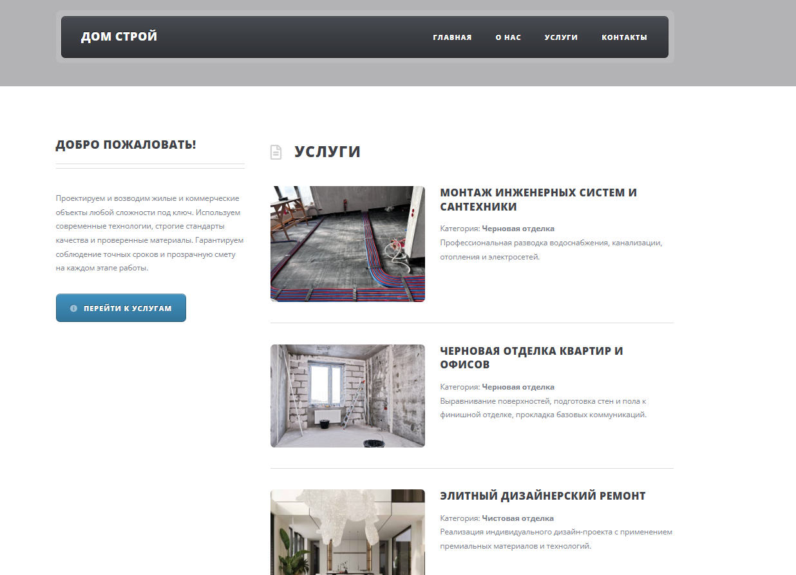
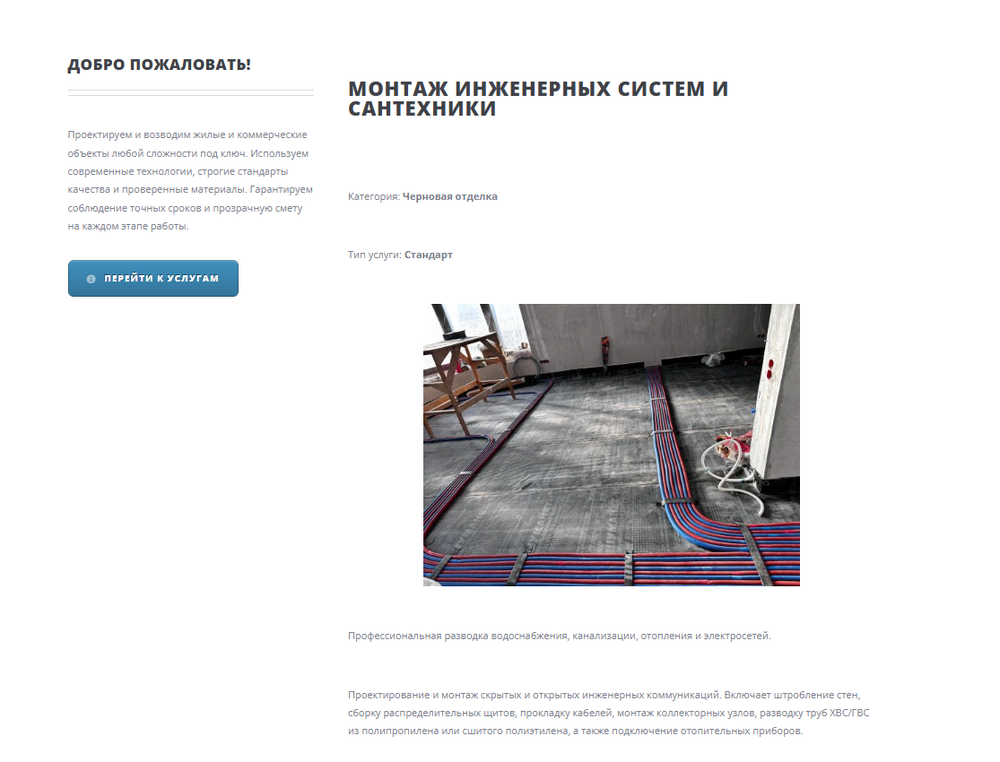
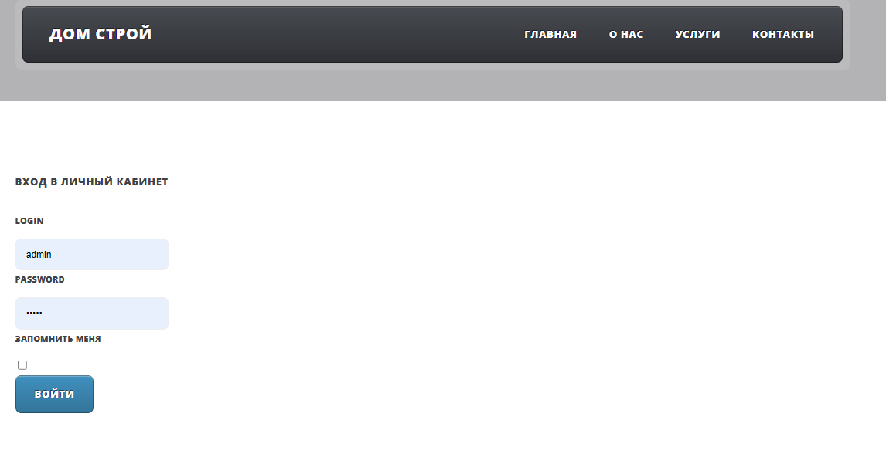
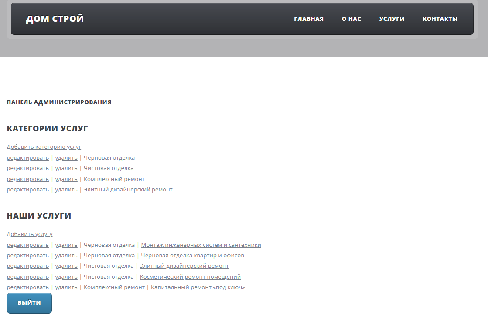
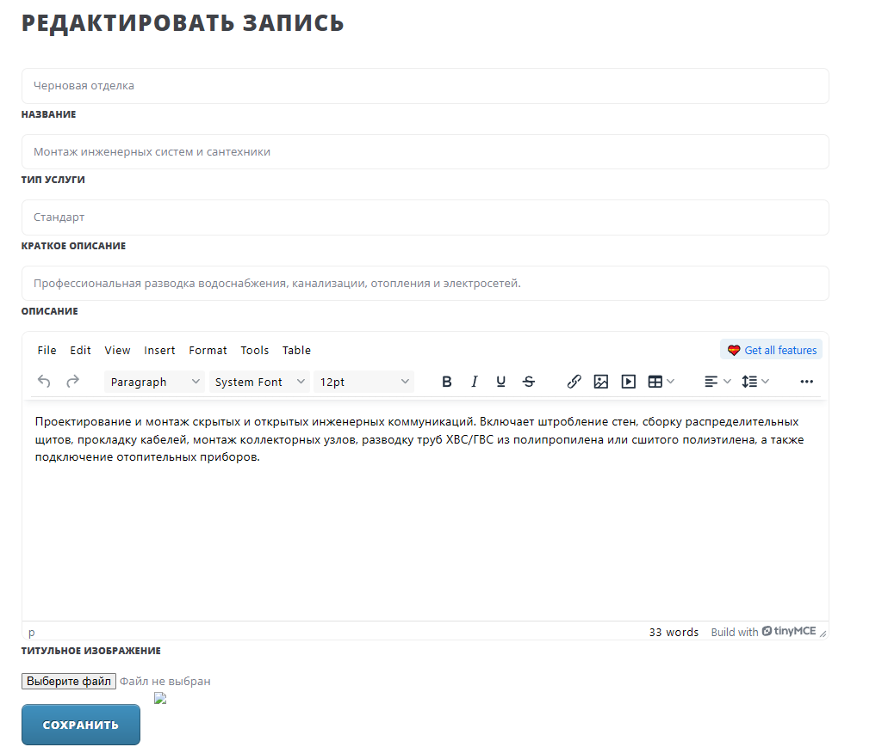

# BuildService.Mvc.Api — «Дом Строй»

> Веб-приложение для строительной компании **«Дом Строй»**, предназначенное для демонстрации и управления каталогом строительных услуг. Проект представляет собой полнофункциональный сайт с публичной частью (витрина услуг, информация о компании, контакты) и закрытой панелью администрирования.

---

## Содержание

- [Описание проекта](#описание-проекта)
- [Стек технологий](#стек-технологий)
- [Инструкция по запуску и развертыванию](#инструкция-по-запуску-и-развертыванию)
  - [Требования к окружению](#требования-к-окружению)
  - [Быстрый запуск через Docker (Основной способ)](#быстрый-запуск-через-docker-основной-способ)
  - [Локальный запуск без Docker (Альтернативный способ)](#локальный-запуск-без-docker-альтернативный-способ-для-разработки)
- [Тестовые учетные данные](#тестовые-учетные-данные)
- [Скриншоты интерфейса](#скриншоты-интерфейса)
- [Структура проекта](#структура-проекта)
- [Конфигурация приложения](#конфигурация-приложения)

---

## Описание проекта

Приложение **«Дом Строй»** — это веб-сайт строительной компании, построенный на базе ASP.NET Core MVC. Пользователи могут просматривать перечень предоставляемых услуг, разбитых по категориям, а также узнавать информацию о компании и контактные данные. Для управления контентом предусмотрена административная панель с WYSIWYG-редактором.

### Роли пользователей

| Роль | Возможности |
| :--- | :--- |
| **Гость (неавторизованный пользователь)** | Просмотр главной страницы, каталога услуг, детальной информации об услугах, страниц «О нас» и «Контакты». |
| **Администратор (`admin`)** | Доступ ко всем возможностям гостя + вход в панель администрирования (`/Admin`). Создание, редактирование и удаление категорий услуг. Создание, редактирование и удаления самих услуг (с загрузкой изображений и использованием визуального редактора TinyMCE). |

> **Note:** Авторизация реализована на базе ASP.NET Core Identity с использованием Cookie-аутентификации. Доступ к контроллеру `Admin` защищен атрибутом `[Authorize(Roles = "admin")]`.

---

## Стек технологий

### Backend
| Технология | Версия / Описание |
| :--- | :--- |
| **C#** | Язык программирования |
| **ASP.NET Core MVC** | .NET 10.0 (`net10.0`) — фреймворк для построения веб-приложений |
| **Entity Framework Core** | 10.0.12 — ORM для работы с базой данных |
| **PostgreSQL** | 15-alpine — реляционная СУБД (используется провайдер `Npgsql.EntityFrameworkCore.PostgreSQL` 10.0.3) |
| **ASP.NET Core Identity** | Система аутентификации и авторизации |
| **Swagger** | Swashbuckle 10.2.3 (доступен в режиме `Development`) |

### Frontend
| Технология | Описание |
| :--- | :--- |
| **HTML5 / CSS3** | Разметка и стилизация (использован готовый адаптивный шаблон) |
| **JavaScript / jQuery** | Клиентская логика (`jquery.min.js`, `jquery.dropotron.min.js`, утилиты шаблона) |
| **Font Awesome** | Иконочный шрифт (`fontawesome-all.min.css`) |
| **TinyMCE** | 8.9.3 — WYSIWYG-редактор для форматирования описаний услуг в админ-панели |

### Инфраструктура и контейнеризация
| Технология | Описание |
| :--- | :--- |
| **Docker** | Контейнеризация приложения (multi-stage build: SDK 10.0 → ASP.NET 10.0) |
| **Docker Compose** | Оркестрация связки «Приложение + База данных» |

---

## Инструкция по запуску и развертыванию

### Требования к окружению

Для работы с проектом вам понадобится:
- **Docker Desktop** (Windows/Mac) или **Docker Engine + Docker Compose** (Linux).
- **Git** — для клонирования репозитория.
- **.NET 10.0 SDK** — *только* если вы планируете локальную разработку без использования Docker.

---

### Быстрый запуск через Docker (Основной способ)

Этот способ является рекомендуемым, так как автоматически поднимает и приложение, и базу данных PostgreSQL в изолированных контейнерах.

#### 1. Клонирование репозитория
```bash
git clone https://github.com/sqv1zyy/BuildService.Mvc.Api.git
cd BuildService.Mvc.Api
```

#### 2. Запуск контейнеров
Выполните команду из корневой директории проекта (где находится файл `docker-compose.yml`):
```bash
docker compose up --build -d
```
> **Note:** Флаг `--build` гарантирует, что образ приложения будет собран из актуального исходного кода. Флаг `-d` запускает контейнеры в фоновом режиме.

#### 3. Доступ к приложению
После успешного запуска приложение будет доступно в вашем браузере по адресу:
**http://localhost:8080**

База данных PostgreSQL проброшена на хост-машину и доступна по порту `5432` (например, для подключения через pgAdmin или DBeaver).

#### 4. Инициализация базы данных и сидинг
Вам **не нужно** вручную применять миграции или создавать таблицы. 
При старте контейнера `api` приложение автоматически выполняет метод `dbContext.Database.EnsureCreatedAsync()` ([Program.cs:89](Program.cs#L89)). Это создаст все необходимые таблицы в базе `dom_stroi` и применит начальный сидинг (seed), заданный в методе `OnModelCreating` ([AppDb.cs:18-63](Domain/AppDb.cs#L18-L63)), включая создание роли `admin` и пользователя `admin` с паролем `admin`.

#### 5. Полезные команды управления Docker

| Команда | Описание |
| :--- | :--- |
| `docker compose logs -f api` | Просмотр логов приложения в реальном времени |
| `docker compose logs -f db` | Просмотр логов базы данных PostgreSQL |
| `docker compose down` | Остановка и удаление контейнеров (данные БД сохранятся в volume) |
| `docker compose down -v` | Остановка и **полное удаление** контейнеров вместе с данными БД |
| `docker compose ps` | Проверка статуса запущенных контейнеров |

---

### Локальный запуск без Docker (Альтернативный способ для разработки)

Если вы хотите вести разработку напрямую на своей машине:

#### 1. Настройка базы данных
Убедитесь, что у вас установлен и запущен локальный сервер PostgreSQL. Создайте базу данных (например, `dom_stroi`).

#### 2. Настройка строки подключения
Создайте файл `appsettings.json` в корне проекта (он добавлен в `.gitignore` для безопасности) со следующей структурой:

```json
{
  "Project": {
    "Database": {
      "ConnectionString": "Host=localhost;Port=5432;Database=dom_stroi;Username=postgres;Password=ваш_пароль"
    },
    "TinyMCE": {
      "APIkey": "ваш_ключ_tinymce_если_нужен"
    }
  },
  "Company": {
    "CompanyName": "Дом строй",
    "CompanyPhone": "+7(999)-222-11-33",
    "CompanyPhoneShort": "+799922211133",
    "CompanyEmail": "support@domstroi.com"
  }
}
```
> **Note:** Приложение читает конфигурацию из секции `"Project"` и мапит её на класс `AppConfig` ([AppConfig.cs](infrastructure/AppConfig.cs)).

#### 3. Применение миграций
Откройте терминал в папке проекта и выполните:
```bash
dotnet ef database update
```
*Примечание: Так как в `Program.cs` используется `EnsureCreatedAsync()`, база данных может создаться автоматически при первом запуске, но использование `dotnet ef database update` является правильной практикой для применения миграций.*

#### 4. Запуск приложения
Через CLI:
```bash
dotnet run
```
По умолчанию приложение запустится на адресах, указанных в [launchSettings.json](Properties/launchSettings.json):
- HTTP: `http://localhost:5163`
- HTTPS: `https://localhost:7297`

Либо откройте проект в **Visual Studio** / **JetBrains Rider** и нажмите кнопку «Run / Запуск».

---

## Тестовые учетные данные

Для входа в панель администратора используйте следующие данные по умолчанию (создаются автоматически при инициализации БД):

| Параметр | Значение |
| :--- | :--- |
| **Логин (UserName)** | `admin` |
| **Пароль** | `admin` |
| **Email** | `ADMIN` |

> **Warning:** Данные учетные данные предназначены только для тестирования и первичной настройки. Обязательно измените пароль перед публикацией сайта в интернет!

---

## Скриншоты интерфейса

Ниже представлены примеры экранов приложения. 

*(Замените пути к изображениям на реальные скриншоты вашего проекта)*

### Главная страница

*Скриншот главной страницы сайта «Дом Строй» с приветственной информацией и общим оформлением шаблона.*

### Каталог услуг

*Скриншот страницы со списком доступных строительных услуг, разбитых по категориям.*

### Детальная страница услуги

*Скриншот страницы просмотра конкретной услуги с изображением, кратким и полным описанием.*

### Форма авторизации

*Скриншот страницы входа в систему (логин/пароль администратора).*

### Панель администрирования

*Скриншот дашборда администратора (`/Admin`) со списками категорий и услуг, а также кнопками «редактировать» и «удалить».*

### Редактирование услуги

*Скриншот формы создания/редактирования услуги с подключенным WYSIWYG-редактором TinyMCE и полем загрузки изображения.*

---

## Структура проекта

Проект организован по стандартной архитектуре ASP.NET Core MVC с элементами паттерна Repository.

```text
BuildService.Mvc.Api/
├── controllers/                  # Контроллеры приложения
│   ├── AccountController.cs      # Аутентификация (Login/Logout)
│   ├── HomeController.cs         # Публичные страницы (Index, About, Contacts)
│   ├── ServicesController.cs     # Публичный каталог услуг (Index, Show)
│   └── Admin/                    # Административная часть (Partial-классы)
│       ├── Core.cs               # Базовый AdminController, DI, Index, загрузка фото
│       ├── ServiceCategories.cs  # CRUD для категорий услуг
│       └── Services.cs           # CRUD для услуг
│
├── Domain/                       # Доменный слой
│   ├── AppDb.cs                  # Контекст БД (AppDbContext) и сидинг данных
│   ├── Entities/                 # Сущности БД
│   │   ├── EntityBase.cs         # Базовый класс (Id, Title, DateCreated)
│   │   ├── Service.cs            # Сущность "Услуга"
│   │   └── ServiceCategory.cs    # Сущность "Категория услуги"
│   ├── Enums/
│   │   └── ServiceTypeEnum.cs    # Перечисление типов услуг (Базовый, Стандарт, Премиум)
│   └── Repositories/             # Паттерн "Репозиторий"
│       ├── DataManager.cs        # Фасад для доступа к репозиториям
│       ├── Abstract/             # Интерфейсы репозиториев
│       └── EntityFramework/      # Реализации репозиториев через EF Core
│
├── Models/                       # DTO и ViewModel
│   ├── LoginViewModel.cs         # Модель для формы входа
│   ├── ServiceDTO.cs             # Объект передачи данных для услуг
│   └── Components/Menu/          # ViewComponent для динамического меню
│
├── Views/                        # Представления (Razor .cshtml)
│   ├── Account/                  # Страницы авторизации
│   ├── Admin/                    # Страницы панели администратора
│   ├── Home/                     # Главная, О нас, Контакты
│   ├── Services/                 # Каталог и карточки услуг
│   └── Shared/                   # Общий Layout и Partial-представления
│       ├── _Layout.cshtml        # Главный макет страницы
│       ├── _CssPartial.cshtml    # Подключение стилей (FontAwesome, main.css)
│       ├── _ScriptsPartial.cshtml# Подключение JS (jQuery, плагины)
│       ├── _HeaderPartial.cshtml # Шапка сайта
│       ├── _FooterPartial.cshtml # Подвал сайта
│       └── _SidebarPartial.cshtml# Боковая панель
│
├── infrastructure/               # Вспомогательные классы
│   ├── AppConfig.cs              # Классы для маппинга appsettings.json
│   └── HelperDTO.cs              # Методы трансформации Entity -> DTO
│
├── Migrations/                   # Автогенерируемые миграции EF Core
│   └── 20261009163345_InitialCreate.cs
│
├── wwwroot/                      # Статические файлы (публичный доступ)
│   ├── css/                      # Стили (main.css, fontawesome)
│   ├── js/                       # Скрипты (jQuery, breakpoints, util и т.д.)
│   ├── lib/tinymce/              # WYSIWYG-редактор TinyMCE 8.9.3
│   ├── images/                   # Загружаемые фотографии услуг
│   └── img/                      # Изображения шаблона (фоны, логотипы)
│
├── Properties/
│   └── launchSettings.json       # Профили запуска для локальной разработки
│
├── Dockerfile                    # Инструкции для сборки Docker-образа (Multi-stage)
├── docker-compose.yml            # Оркестрация приложения и PostgreSQL
├── .dockerignore                 # Исключения для контекста Docker-сборки
├── BuildService.Mvc.Api.csproj   # Файл проекта .NET
├── BuildService.Mvc.Api.slnx     # Файл решения Visual Studio
├── bundleconfig.json             # Конфигурация бандлов CSS/JS
├── appsettings.production.json   # Настройки для среды Production
├── appsettings.staging.json      # Настройки для среды Staging
└── README.md                     # Этот файл
```

---

## Конфигурация приложения

Настройки приложения считываются из файлов `appsettings.*.json` и переменных окружения. Все параметры обернуты в корневую секцию `"Project"` и мапятся на C#-объект `AppConfig` ([infrastructure/AppConfig.cs](infrastructure/AppConfig.cs)).

| Секция | Описание |
| :--- | :--- |
| `Project:Database:ConnectionString` | Строка подключения к PostgreSQL. При запуске через Docker Compose передается через переменную окружения. |
| `Project:TinyMCE:APIkey` | API-ключ для расширенных функций облачного редактора TinyMCE (опционально). |
| `Company:*` | Информация о компании (Название, Телефон, Email), используемая в представлениях (шапка, подвал, метатеги). |

> **Note:** Файл `appsettings.json` (для локальной разработки) исключен из системы контроля версий (`.gitignore`), чтобы предотвратить случайную публикацию паролей от вашей локальной базы данных. Используйте `appsettings.production.json` или переменные окружения для настройки на сервере.

